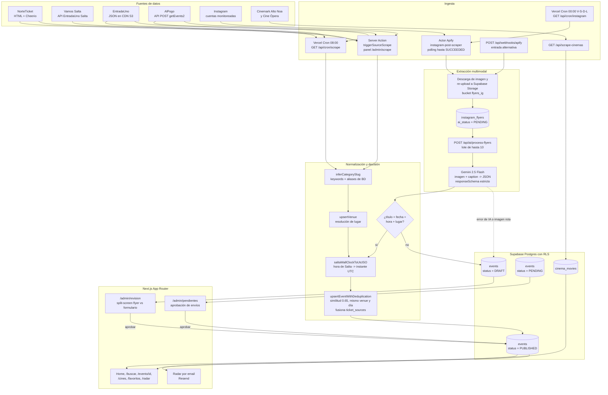

# Qué Pinta Salta

Agenda cultural automatizada de Salta Capital. Sitio en producción: **[quepintasalta.com.ar](https://www.quepintasalta.com.ar)**

---

## Descripción y problema que resuelve

La oferta de eventos de Salta Capital está fragmentada entre ticketeras que no se hablan entre sí (NorteTicket, EntradaUno, AlPogo, el portal provincial Vamos Salta) y, sobre todo, entre historias y posteos de Instagram de boliches y productores independientes, donde la información vive como imagen y texto libre — no como dato.

El resultado para el usuario es que no existe un único lugar donde ver qué hay para hacer esta noche, y para los organizadores, que su evento aparece disperso o directamente no aparece.

Qué Pinta Salta resuelve eso con un pipeline de ingesta multi-fuente que:

1. **Extrae** eventos de cuatro ticketeras (tres vía API JSON, una vía scraping HTML) y de cuentas de Instagram monitoreadas a través de Apify.
2. **Estructura** los flyers de Instagram con **Gemini 2.5 Flash** como extractor multimodal: la imagen del flyer más el caption entran, y sale un JSON con título, fecha, hora, precio, lugar, categoría y artistas, validado contra un `responseSchema` estricto.
3. **Deduplica** eventos que aparecen en varias fuentes usando similitud de títulos (Jaccard con normalización y stop words, umbral 0.65) acotada a mismo venue y mismo día calendario. Cuando hay match, no crea un duplicado: fusiona los links de compra en un array `ticket_sources` y se queda con el precio más bajo y la mejor imagen.
4. **Decide** con un filtro determinista en TypeScript — no con la IA — si un evento se auto-publica o cae a revisión humana en un panel admin.

El punto de diseño importante es el número 4: el modelo extrae, pero no publica. La compuerta es código, y es auditable.

---

## Arquitectura



### Notas sobre el flujo real

- **Solo Instagram pasa por Gemini.** Las otras cuatro fuentes devuelven datos ya estructurados (JSON de API en Vamos Salta, EntradaUno y AlPogo; DOM parseado con Cheerio en NorteTicket) y se normalizan con código determinista. No hay LLM en esa ruta.
- **Existen dos rutas de ingesta para las ticketeras**: el cron diario usa los providers de `app/api/cron/scrape/providers/`, y el panel admin usa los scrapers de `lib/scraper/` mediante Server Actions. La diferencia práctica es que la ruta manual además visita la página de detalle de cada evento, así que trae descripción real y clasifica mejor; el cron se queda con lo que hay en el listado.
- **La clasificación tiene tres niveles de prioridad**: alias definidos por un admin en la tabla `aliases` (override manual), inferencia por keywords de `inferCategorySlug`, y fallback a `espectaculos`. El campo `classification_source` deja registro de cuál ganó.
- **Los flyers de Instagram tienen TTL de 14 días**: `archiveExpiredFlyers` corre al final del cron de scraping y los pasa a `ARCHIVED`.
- **Si Gemini falla** (timeout, imagen ilegible, error de API), el pipeline no descarta el flyer: crea un evento `DRAFT` con título `Revisar: Flyer de @cuenta`, marca el flyer como `FAILED` y lo deja en la cola de revisión humana con el caption original como descripción.

### Manejo de horarios

`events.start_date` es `timestamptz` y guarda el **instante UTC real**. Las fuentes, en cambio, publican la hora de pared de Salta sin zona (`2026-08-07T21:00:00`), igual que los `<input type="datetime-local">` de los formularios. La conversión entre ambos mundos vive en [`lib/date-format.ts`](lib/date-format.ts) y es obligatoria en los dos sentidos:

- Al escribir: `saltaWallClockToUtcISO()`. Es idempotente — si el valor ya trae `Z` u offset explícito, lo respeta.
- Al leer: `formatEventDate` / `formatEventTime` / `formatSaltaDayKey` / `formatSaltaClock`, todas ancladas a `America/Argentina/Salta`.

La única excepción es `instagram_flyers.published_at`, que Apify entrega como instante UTC real y no se convierte. Cuando Gemini no logra extraer la fecha del flyer, ese valor se usa como `start_date` tal cual.

Nunca hay que hacer `start_date.split('T')[0]` ni `toISOString().split('T')[0]` para obtener el día: devuelven el día UTC y corren la fecha en cualquier evento de la noche. Para eso está `formatSaltaDayKey()`.

### Deduplicación de eventos

El mismo evento entra por varias fuentes a la vez y sin dedup queda como N filas con datos contradictorios. La clave de agrupación es **título normalizado + día calendario de Salta** ([`lib/scraper/dedup-key.ts`](lib/scraper/dedup-key.ts)): sin diacríticos, en minúsculas, sin sufijo de ciudad (`"EN SALTA"`, `"Salta 2026"`, `"Salta Capital"`) y con los espacios colapsados. No se usa el venue en la clave, justamente porque los duplicados que importan son los que escriben el lugar distinto o no lo traen.

Cuando dos registros coinciden pero difieren en un campo, gana la fuente de mayor prioridad ([`lib/scraper/source-priority.ts`](lib/scraper/source-priority.ts)):

| Tramo | Peso | Fuentes | Por qué |
|---|---|---|---|
| Ticketera oficial | 400 | `norteticket`, `entradauno`, `alpogo`, … | Vende la entrada: si el evento se mudó de sala o cambió de horario, su dato tiene que estar bien o no cobra |
| Portal provincial | 300 | `vamos` | Agenda oficial, confiable pero copiada a mano y lenta para los cambios |
| Carga manual | 200 | formulario de admin/colaborador | Puede ser más precisa que cualquier scraper, pero nadie vuelve a editarla |
| Instagram | 100 | `instagram-ai` | Máxima cobertura, mínima precisión: el lugar sale del handle y el horario lo leyó Gemini de una imagen |

El merge **no pisa datos**: une todos los links de compra en `ticket_sources`, completa los campos vacíos, y guarda cada variante descartada — con su motivo y su fuente — en `events.merge_audit`. `price_min` se agrega al mínimo positivo en vez de resolverse por prioridad (es "lo más barato que se consigue", no un dato en disputa), el `slug` nunca cambia porque la URL ya está publicada, y el `status` no se toca salvo para promover un `DRAFT` que una ticketera confirmó.

La dedup se aplica **en la ingesta**, en `upsertEventWithDeduplication()`, que es el único punto de escritura de las tres rutas automáticas (cron, panel admin, Instagram). El job de limpieza es sólo para lo que ya está en la base:

```bash
npm run dedup:events                 # dry-run desde hoy: reporta qué fusionaría
npm run dedup:events -- --include-past   # dry-run sobre todo el histórico
npm run dedup:events -- --apply      # ejecuta las fusiones
npm run dedup:check                  # chequeo de la lógica sobre fixtures, sin base
```

El dry-run es el default y no escribe nada: imprime el total de fusiones, quién sobrevive en cada grupo y qué conflicto se resuelve cómo. Lo mismo está expuesto en `GET /api/admin/dedup` (dry-run) y `POST /api/admin/dedup` con `{ "apply": true }`. Al aplicar, las filas absorbidas se borran recién después de dejar su snapshot JSON completo en el `merge_audit` del sobreviviente, y los favoritos y las vistas se repuntan.

### El filtro determinista

En `lib/ai/process-flyer-ai.ts`, después de la extracción:

```ts
const hasTitle = !!extractedData.title && extractedData.title.trim().length > 0
const hasDate  = !!extractedData.date && /^\d{4}-\d{2}-\d{2}$/.test(extractedData.date)
const hasTime  = !!extractedData.start_time && /^\d{2}:\d{2}$/.test(extractedData.start_time)
const hasVenue = !!venueName && venueName !== 'Lugar no especificado'

const qualifiesForAutoPublish = !!(hasTitle && hasDate && hasTime && hasVenue)
const eventStatus = qualifiesForAutoPublish ? 'PUBLISHED' : 'DRAFT'
```

Los cuatro campos son obligatorios y se validan por forma, no por confianza del modelo. Además, si la fecha extraída es anterior a hoy en `America/Argentina/Salta`, el flyer se marca `SKIPPED` y no genera evento.

---

## Estado de las fuentes

| Fuente | Método de extracción | Pasa por Gemini | Estado |
|---|---|---|---|
| Vamos Salta | API REST de EntradaUno Salta (`/v1/api/v2/Cartelera`), JSON estructurado | No | Activo |
| EntradaUno | JSON estático en CDN S3, filtrado por `idProvincia = 16` | No | Activo |
| AlPogo | API POST `getEvents2`, JSON estructurado | No | Activo |
| Instagram (Apify) | Actor `apify~instagram-post-scraper` + Gemini 2.5 Flash | Sí | Activo |
| Cines | Scraping HTML de Cinemark Alto Noa y Cine Ópera | No | Activo |
| NorteTicket | Scraping HTML con Cheerio | No | Activo |

### Nota sobre el parseo de NorteTicket

Los selectores del DOM de NorteTicket viven en un solo lugar, `parseAllEventsFromHtml` en [`lib/scraper/parsers.ts`](lib/scraper/parsers.ts), y tanto el cron como la ruta manual del panel admin los consumen desde ahí. Si NorteTicket cambia su HTML, se toca un archivo y no dos.

El provider del cron lanza en vez de devolver un array vacío cuando la fuente no responde o cuando el HTML deja de matchear el selector `div#boxEvent`. El job usa `Promise.allSettled`, así que una fuente caída no frena a las otras, pero el error queda en el campo `sourceErrors` de la respuesta y `success` pasa a `false`. Ese comportamiento es deliberado: la falla anterior de esta fuente fue invisible durante meses justamente porque el `catch` se tragaba el error y el cron reportaba `success: true` con cero eventos.

---

## Stack técnico

| Capa | Tecnología | Notas |
|---|---|---|
| Framework | Next.js 16 (App Router) | Server Components, Server Actions, rutas interceptadas (`@modal`) para modales de evento y flyer |
| UI | React 19 | |
| Estilos | Tailwind CSS 4 | Modo oscuro por clase vía `next-themes`, default `dark` |
| Componentes | Radix UI + shadcn/ui | Set completo en `components/ui/` |
| Animaciones | Framer Motion 12 | |
| Base de datos | Supabase (PostgreSQL) | RLS activo en todas las tablas de dominio |
| Auth | Supabase Auth | Email/password y Google OAuth; middleware refresca la sesión en cada request |
| Storage | Supabase Storage | Bucket `flyers_ig` para re-upload de imágenes de Instagram (máx. 5 MB) |
| IA | Gemini 2.5 Flash vía `@google/genai` | `temperature: 0.1`, `responseMimeType: application/json`, `responseSchema` con enum de categorías |
| Scraping | Cheerio 1.2, Puppeteer 25 | Cheerio para HTML estático, Puppeteer disponible para carteleras de cine |
| Scraping externo | Apify | Actor `apify~instagram-post-scraper`, disparado por cron con polling (timeout 3 min) o recibido por webhook |
| Email | Resend | Newsletter del Radar |
| Validación | Zod 3 + React Hook Form | |
| Analítica | Vercel Analytics + Google Tag Manager | |
| Hosting y cron | Vercel | `vercel.json` define los dos cron jobs |
| Lenguaje | TypeScript 5.7 | |

### Modelo de datos

Tablas principales: `events`, `venues`, `categories`, `aliases`, `profiles`, `user_favorites`, `instagram_accounts`, `instagram_flyers`, `cinema_movies`, `scrape_sources`, `scrape_runs`, `event_views`, y las tablas del Radar (`user_radar_settings`, `user_followed_categories`, `user_followed_venues`, `user_followed_instagram_accounts`).

`data_migrations` es una tabla auxiliar: registra las migraciones que modifican datos (no esquema) para que reaplicarlas sea idempotente.

Enums relevantes:

- `UserRole`: `USER` | `ADMIN` | `COLLABORATOR`
- `EventStatus`: `DRAFT` | `PUBLISHED` | `CANCELLED` | `PAST` | `PENDING`
- `ai_status` de flyers: `PENDING` | `PROCESSED` | `FAILED` | `SKIPPED`

RLS está habilitado en todas ellas. El patrón general es lectura pública de contenido publicado, escritura restringida a `ADMIN` o al dueño de la fila, y una migración dedicada (`20260623_prevent_role_tampering.sql`) que impide que un usuario se escale el propio `role`.

### Cron jobs

| Path | Schedule | Qué hace |
|---|---|---|
| `/api/cron/scrape` | `0 8 * * *` | Corre los tres providers de ticketeras en paralelo (`allSettled`), hace upsert con deduplicación y archiva flyers de Instagram vencidos |
| `/api/cron/instagram` | `0 0 * * 0,1,5,6` | Dispara el actor de Apify sobre las cuentas activas, espera el run y persiste los flyers nuevos |

Ambos validan `Authorization: Bearer ${CRON_SECRET}`. `/api/ai/process-flyers` y `/api/webhooks/apify` validan `APIFY_WEBHOOK_SECRET`.

---

## Funcionalidades

Todo lo listado acá está implementado y activo en el código.

**Descubrimiento**

- Home con carrusel de destacados, filas por categoría y filtros por categoría, lugar, fecha y precio.
- Búsqueda en `/buscar`.
- Detalle de evento con rutas interceptadas: el mismo contenido se abre como modal desde la grilla o como página completa en `/evento/[id]`, con URL compartible en ambos casos.
- Cartelera de cines en `/cines`, con normalización de títulos que colapsa las variantes de formato (2D, 3D, XD, doblada, subtitulada) en una sola ficha con todas sus funciones.
- Multi-ticketera: cuando el mismo evento se scrapea de varias fuentes, la ficha muestra todos los links de compra desde `ticket_sources`.

**Cuenta y personalización**

- Registro y login con email/password o Google OAuth.
- Favoritos por usuario, persistidos en `user_favorites` con RLS por dueño.
- **Compartir agenda por WhatsApp**: desde `/favoritos` se arma un mensaje con la lista de eventos guardados y un link a cada uno, y se abre el share nativo de WhatsApp. También hay compartir individual desde cada tarjeta.
- **Radar por email**: suscripción por categoría, por lugar y por cuenta de Instagram, con frecuencia configurable (semanal, quincenal, mensual o desactivado). El envío usa Resend con plantilla HTML propia.
- Modo oscuro con `next-themes`, default oscuro y respeto por la preferencia del sistema.
- Carga de eventos por usuarios autenticados en `/nuevo-evento`, con gestión propia en `/mis-eventos` y aprobación por admin en `/admin/pendientes`.

**Panel administrativo**

- `/admin/revision`: revisión de borradores en layout split-screen — el flyer original de Instagram fijo a un lado, el formulario editable con lo que extrajo Gemini al otro, más el JSON crudo de `ai_metadata` para auditar la extracción. Publicar o descartar en un click.
- `/admin/scrape`: ejecución manual de cada fuente con historial de corridas en `scrape_runs` (estado, insertados, omitidos, errores, quién la disparó).
- `/admin/clasificacion`: clasificación manual de eventos sin categoría.
- `/admin/aliases`: mapeo de alias a categorías y lugares, que tiene prioridad sobre la inferencia automática.
- `/admin/instagram`: alta y baja de cuentas monitoreadas, con venue, categoría y URL de Maps por defecto para cada una.
- `/admin/users`: gestión de roles.

**Monetización directa**

- Botón de contacto por WhatsApp para anunciantes en el footer y en los slots publicitarios, con mensaje pre-cargado. El número sale de `NEXT_PUBLIC_CONTACT_WHATSAPP`.
- Marcado de eventos como `is_commercial` y `is_featured` para priorización en home.

**SEO**

- `sitemap.ts` y `robots.ts` dinámicos, Open Graph y Twitter Cards, metadata por evento.

---

## Roadmap

- **Google AdSense.** El componente `AdSenseBanner` y el gate por `NEXT_PUBLIC_ADSENSE_CLIENT_ID` ya existen, pero la cuenta no está aprobada ni la variable configurada en producción: hoy ese slot siempre renderiza el CTA de contacto directo por WhatsApp. Falta la aprobación y el alta de slots.
- **Analítica de datos para campañas publicitarias.** La tabla `event_views` ya acumula vistas por evento con user agent e IP. Falta el dashboard: métricas por categoría, por venue y por franja horaria, para vender espacios con números en la mano.
- **Rol de colaborador / RRPP para boliches.** La base ya está mergeada — `COLLABORATOR` en `UserRole`, `PENDING` en `EventStatus`, campos `contact_type` y `contact_value` en `profiles`, y el circuito `/nuevo-evento` → `/mis-eventos` → `/admin/pendientes`. Falta el onboarding específico para RRPP, los permisos diferenciados por local y las métricas propias de cada colaborador.
- **Geocodificación de venues.** `venues` tiene columnas `latitude`, `longitude` y `google_maps_url` que ningún scraper completa, y [`lib/scraper/venue-enrichment.ts`](lib/scraper/venue-enrichment.ts) quedó como stub sin usar.
- **Expansión a otras provincias**: Qué Pinta Mendoza y Qué Pinta Córdoba, reutilizando el pipeline con fuentes y configuración por provincia.

---

## Desarrollo local

```bash
npm install
```

Variables de entorno en `.env.local`:

```env
# Supabase
NEXT_PUBLIC_SUPABASE_URL=
NEXT_PUBLIC_SUPABASE_ANON_KEY=
SUPABASE_SERVICE_ROLE_KEY=

# IA y scraping externo
GEMINI_API_KEY=
APIFY_API_TOKEN=
APIFY_WEBHOOK_SECRET=

# Cron
CRON_SECRET=

# Email
RESEND_API_KEY=
RESEND_FROM_EMAIL=

# Contacto y publicidad
NEXT_PUBLIC_CONTACT_WHATSAPP=
NEXT_PUBLIC_ADSENSE_CLIENT_ID=   # opcional, sin esto se renderiza el CTA de WhatsApp
```

Aplicar las migraciones de `supabase/migrations/` en orden cronológico y levantar el servidor.

> [`20260805_fix_event_timezone_offset.sql`](supabase/migrations/20260805_fix_event_timezone_offset.sql) es una migración de **datos**, no de esquema: corrige las filas de `events` que se habían guardado con la hora de Salta etiquetada como UTC. Es idempotente vía la tabla `data_migrations`, así que reaplicarla no hace nada.

```bash
npm run dev
```

Ejecución manual de scrapers:

```bash
npx tsx lib/scraper/vamos-scraper.ts
```

Los scrapers también se pueden disparar desde `/admin/scrape` con una cuenta `ADMIN`, que es la vía recomendada porque registra la corrida en `scrape_runs`.

---

## Autor

**Mauro Alejandro Lizárraga**

- LinkedIn: [mauro-alejandro-lizarraga](https://www.linkedin.com/in/mauro-alejandro-lizarraga-8260711a3/)
- Portfolio: [malejoportfolio.netlify.app](https://malejoportfolio.netlify.app)
- GitHub: [@Malejo01](https://github.com/Malejo01)
- Producción: [quepintasalta.com.ar](https://www.quepintasalta.com.ar)
